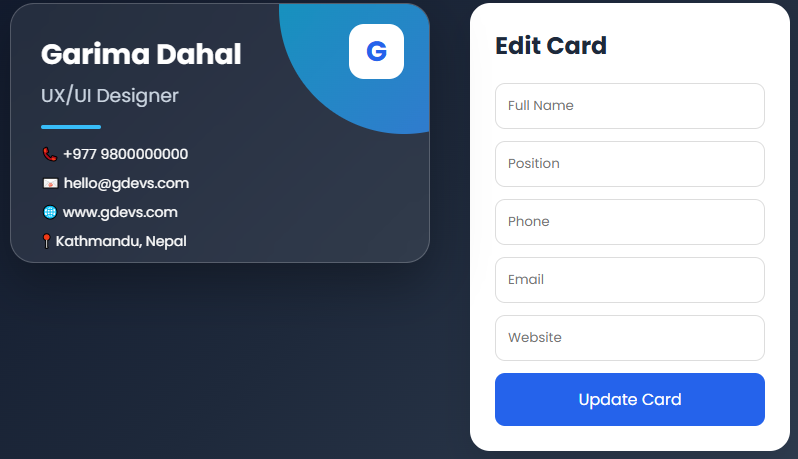

# UX-UI
Modern, user-centric UX/UI focused on simplicity, accessibility, and responsiveness. Features intuitive navigation, consistent design components, clear visual hierarchy, and seamless interactions across devices. Built to enhance usability, improve engagement, and deliver a fast, efficient, and enjoyable UX
 
# Business card output

